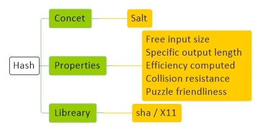
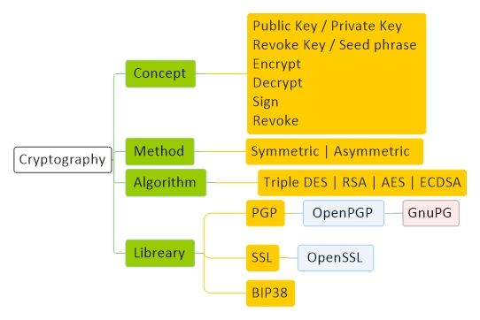

 
<a href="#hash">Hash</a> -
<a href="#cryptography">Cryptography</a>

<!-----------------------------------------------------------Hash----------------------------------------------------------->
## Hash

<!---------------------------------------Resource-->
#### Resource
General : hash break website

<!---------------------------------------Concept-->
#### Concept

یک تابع که یک ورودی بگیرد و همیشه یک خرجی ثابت بابت این ورودی بدهد
چون خروجی‌ ثابت است و ورودی بی‌ نهایت، پس ۱۰۰ درصد ورودی‌های مختلف با خروجی یکسان خواهیم داشت، اما خروجی‌ اینقدر بزرگ که این مساله اصلا مهم نیست

salt

<!---------------------------------------Properties-->
#### Properties
Free input size

Specific output length

Efficiency computed

Collision resistance : نتونن ورودی رو جوری تغییر بدن که به هش مورد نظرشون برسن

Hiding : نباید از هش به دیتا برسم

Puzzle friendliness : خیلی سریع تولید نشه

<!---------------------------------------Libreary-->
#### Libreary
sha256

<!---------------------------------------Command-->
#### Command
<table ><tbody>
<tr><td colspan="2" align="center" bgcolor="D1ECCF">General</td></tr>
<tr>
<td  align="center">Power</td>
<td align="center">echo '2^256' | bc</td>
</tr>
</tbody></table>

<table ><tbody>
<tr><td colspan="2" align="center" bgcolor="D1ECCF">Ascii</td></tr>
<tr>
<td  align="center">Convert character to ascii</td>
<td align="center">echo "a" | od -An -t dC | awk '{print $1}'</td>
</tr>
<tr>
<td  align="center">Convert ascii to character</td>
<td align="center">echo 97 | awk '{printf("%c",$1)}'</td>
</tr>
</tbody></table>

<table ><tbody>
<tr><td colspan="2" align="center" bgcolor="D1ECCF">Binary</td></tr>
<tr>
<td  align="center">Convert number to binary</td>
<td align="center">echo "obase=2; 97" | bc</td>
</tr>
<tr>
<td  align="center">Convert binary to number</td>
<td align="center">echo "$((2#1100001))"</td>
</tr>
<tr>
<td  align="center">View file as Binary</td>
<td align="center">xxd -b a.txt</td>
</tr>
</tbody></table>

<table ><tbody>
<tr><td colspan="2" align="center" bgcolor="D1ECCF">Hash</td></tr>
<tr>
<td  align="center">Generate hash from character </td>
<td align="center">echo a | sha256sum</td>
</tr>
<tr>
<td  align="center">Generate hash from file</td>
<td align="center">sha256sum a.txt</td>
</tr>
</tbody></table>

<!---------------------------------------Script-->
#### Script

    import hashlib

    for i in range(1,1000000):

        data='my name is jadi and my 123456 is my student number. ' + str(i)
        m = hashlib.sha256()
        m.update(data.encode('utf-8'))
        hash = m.hexdigest()

        if hash[-4:] == "1111" :
            print('found it ',i, data)
            break

<!-----------------------------------------------------------Cryptography----------------------------------------------------------->

## Cryptography

<!---------------------------------------Resource-->
#### Resource
General : 
<a href="https://en.wikipedia.org/wiki/Pretty_Good_Privacy" target="_blank">PGP</a> - 
<a href="https://www.openpgp.org/" target="_blank">OpenPGP</a> - 
<a href="https://gnupg.org/" target="_blank">GnuPG</a>
  Tutorial :
<a href="https://www.devdungeon.com/content/gpg-tutorial" target="_blank">devdungeon</a> - 
<a href="https://stylesuxx.github.io/steganography/" target="_blank">steganography</a>
  Tools :
<a href="http://wot.deedbot.org/" target="_blank">deedbot</a>

Adaptor signature

<!---------------------------------------Concept-->
#### Concept

در این سیستم ما ۲ تا کلید داریم، یکی‌ برای رمزنگاری اطلاعات(Public Key) و یکی‌ برای رمزگشایی اطلاعات (Private Key)

فرض کنید ۵ نفر می‌خواهد برای ما به صورت رمزشده اطلاعاتی‌ بفرستند، باید چی‌ کار کنیم ؟

ما (Public Key) را در اختیار همهٔ آنها  قرار میدهیم و آنها با (Public Key) اطلاعاتی‌ را رمزنگاری می‌‌کنند، اطلاعات رمز شده را فقط کسی‌ میتواند رمزگشایی کند که (Private Key) را در اختیار داشته باشد و اون شخص کسی‌ نیست جز خود ما 

حالا از کجا بفهمیم که هر پیغام برای چه کسی‌ است ؟

حالا اگر هر کسی‌ بتونه پیغام خودش رو امضا کنه و ما بتونیم امضای هر کسی‌ رو برسی‌ کنیم، میتونیم بفهمیم هر پیغام برای چه کسی‌ هست
پس با استفاده از یک فانکشن که Private_key و Data رو به عنوان ورودی میگیره و یک امضا برای اون دیتا درست می‌کنه، می‌تونیم دیتای خود را امضا کنیم و امضا رو در اختیار دیگران قرار می دهیم تا بررسی کنن اطلاعاتی که بدستشون میرسه از طرف ما هست یا نه

اینجوری امضا می کنیم : MySign = Sign(private_key, data)

اینجوری امضا رو چک می کنیم : ValidateSign = Validate(public_key, MySign, data )

Private Key / Public Key / Revoke Key / Encrypt / Decrypt / Sign / Revoke | Seed phrase

Web of trust

برای اینکه مطمئن بشیم کلید عمومی که داریم برای شخص مورد نظرمون هست یا نه

<!---------------------------------------Method-->
#### Method

Symmetric

در این روش برای رمز کردن اطلاعات و همچنین باز کردن اطلاعات از یک کلید استفاده می‌‌شود

Asymmetric

در این روش از یک کلید برای رمز کردن اطلاعات و از یک کلید دیگر برای باز کردن اطلاعات استفاده می‌‌شود

secp256k1 :  رمزنگاری منحنی بیضوی

<!---------------------------------------Algorithm-->
#### Algorithm
Triple DES

RSA

AES

ECDSA

<!---------------------------------------Libreary-->
#### Libreary
PGP

OpenPGP

GnuPG 

BIP38

<!---------------------------------------Command-->
#### Command
<table ><tbody>
<tr><td colspan="2" align="center" bgcolor="D1ECCF">General</td></tr>
<tr>
<td  align="center">Generate</td>
<td align="center">gpg --full-generate-key</td>
</tr>
<tr>
<td  align="center">List</td>
<td align="center">gpg --list-keys   gpg --list-secret-keys</td>
</tr>
<tr>
<td  align="center">Delete</td>
<td align="center">gpg --delete-secret-key morteza   gpg --delete-key morteza</td>
</tr>
<tr>
<td  align="center">Import</td>
<td align="center">gpg --import public_key   gpg --import private_key   gpg --edit-key 79241793755C3E54   trust   5</td>
</tr>
<tr>
<td  align="center">Export</td>
<td align="center">
gpg --export morteza > public_key   gpg --export --armor morteza > public_key.asc 
  
gpg --export-secret-keys morteza > private_key   gpg --export-secret-keys --armor morteza > private_key.asc
</td>
</tr>
<tr>
<td  align="center">Encrypted   Decrypted</td>
<td align="center">
gpg --out file.encrypted --recipient morteza --encrypt file.original 
 
gpg --out file.decrypted --decrypt file.encrypted
</td>
</tr>
<tr>
<td  align="center">Signature</td>
<td align="center">
gpg --local-user morteza --detach-sign --sign --armor --output file.sign file.original 
 
gpg --verify file.sign file.original
</td>
</tr>
<tr>
<td  align="center">Revoke</td>
<td align="center">gpg --out file.revoke --gen-revoke morteza</td>
</tr>
<tr>
<td  align="center">Get fingerprint of Publick key</td>
<td align="center">gpg --show-keys ThomasV.asc  </td>
</tr>

<tr>
<td  align="center">Verify Data With Signature</td>
<td align="center">gpg --import public_key gpg --verify signature data </td>
</tr>

</tbody></table>

<!---------------------------------------Script-->
#### Script

https://www.digitalocean.com/community/tutorials/how-to-set-up-ssh-keys-on-ubuntu-1804

    ssh-keygen -t rsa -b 2048
    ssh root@185.177.23.137 mkdir -p .ssh
    cat .ssh/id_rsa.pub | ssh root@185.177.23.137 'cat >> .ssh/authorized_keys'
